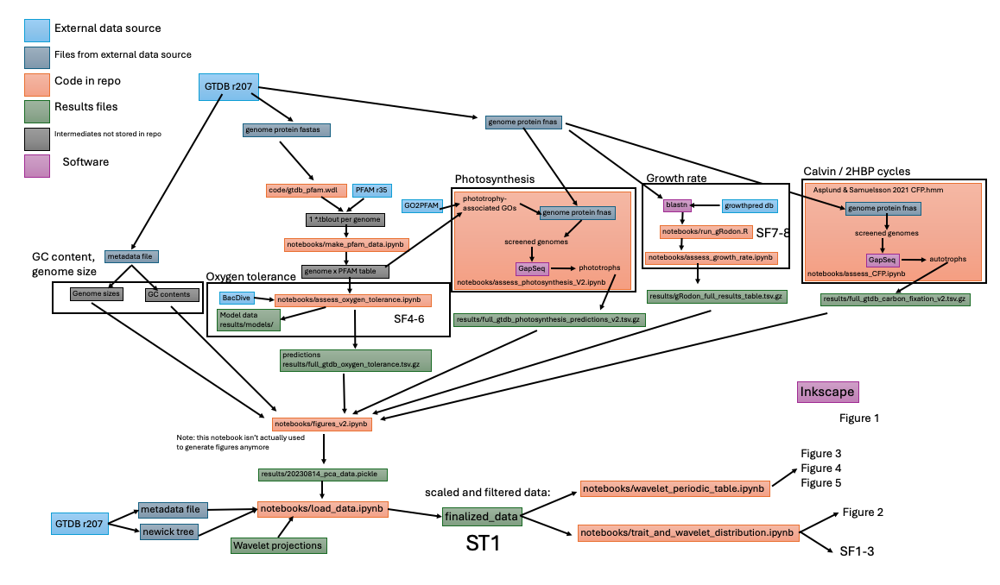

# A periodic table of bacteria

This repository contains code for generating figures and analyses associated with the paper "Building a periodic table of bacterial taxa; mapping bacterial diversity into trait space".

The code here was written by Michael Hoffert and Evan Gorman. The corresponding author is Michael Hoffert, michael.hoffert@colorado.edu

# Table of Contents

1. [Installation](#installation)
2. [Code architecture](#code-architecture)
3. [Generating trait data](#generating-trait-data)
4. [Code for figures and analyses](#analysis-code)

## Installation

This is a multi-year project with complex dependencies; some packages were used for analyses which were not included in the final paper. Sorry if this is annoying to install.

Install the software with `mamba`:
```bash
mamba env create -f environment.yaml
```

Other software may be required, including:
* blast
* [gRodon](https://github.com/jlw-ecoevo/gRodon2)
* R / RStudio
* [ete3 / etetoolkit](https://pypi.org/project/ete3/): a locally installed version was used here to avoid bugs which break tree rendering
* [GapSeq](https://github.com/jotech/gapseq)

### Additional dependencies

This code requires local versions of the PFAM database (r35) and the GTDB database (r207).

# Code architecture



# Generating trait data

The paper contains estimations of 6 traits. Please see "Materials and Methods" section of the accompanying manuscript for descriptions of how these traits were generated.  

1. GC content: drawn directly from GTDB metadata
2. Genome size: drawn directly from GTDB metadata
3. Oxygen tolerance: Random forest based on BacDive + Pfam
4. Phototrophy: Annotations of chlorophyll synthesis genes using Pfam, GO, and GapSeq
5. Carbon fixation: Annotations of carbon fixation genes using Pfam, GO, and GapSeq
6. Growth rate: predicted from ribosomal proteins from the growthpred DB using gRodon v2.

Each trait has a dedicated notebook, identified in the code outline, used to generate the trait estimates. When necessary, intermediate files for the traits are saved in `results` or `data`.

# Analysis code

Two main notebooks are used to generated the periodic table and accompanying figures:
1. `notebooks/trait_and_wavelet_distribution.ipynb`: Used to generate Figure 2, the distributions of traits across taxa, and supplementary figures summarizing the dataset.
2. `notebooks/wavelet_periodic_table.ipnyb`: Used to generate Figures 3-5, outlining the periodic table, and performing accompanying analyses. The workflow in this notebook is:  
   a. Load trait data, pre-computed wavelets, and tree from `finalized_data`  
   b. Calculate amount of variance associated with different numbers of wavelets (Figure 3)  
   c. Decide how much variance to capture (60% in manuscript)  
   d. Prune phylogeny to 60% representation  
   e. Generate placement of tips in phylogeny in 2D space for layout of table (results saved in `finalized_data`)  
   f. Draw table  
   
## Additional notes
Construct the `environment.yaml` file:
```
# Extract installed pip packages
pip_packages=$(mamba env export | grep -A9999 ".*- pip:" | grep -v "^prefix: ")

# Export conda environment without builds, and append pip packages
mamba env export --from-history | grep -v "^prefix: " > environment.yaml
echo "$pip_packages" >> environment.yaml
```
